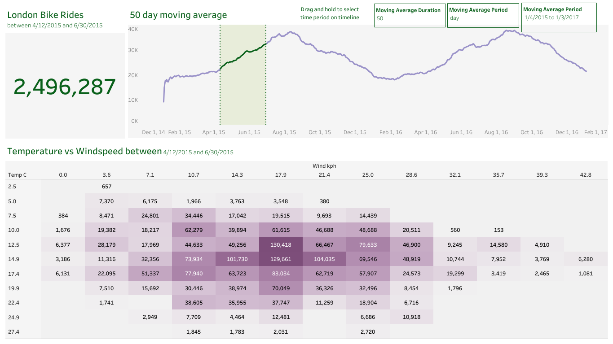

# London-Bikes-Sharing-Review

This repository contains an analysis of the London Bike Sharing dataset using Python and Tableau. The dataset provides information on bike rentals in London, including the number of bikes rented, weather conditions, and other relevant features.

# Dataset
The dataset used for this analysis can be found on kaggle, using the kaggle import download. I have also uploaded the dataset used tagged "london_merged.csv" in the repository. It includes historical data on bike rentals in London, with various attributes such as date, time, weather conditions, and the number of bikes rented.

# Analysis
The analysis process involved data cleaning and preparation in Python, followed by data visualization using Tableau. The goal was to gain insights into bike rental patterns and understand the factors influencing bike usage in London.

# Data Cleaning
Python scripts were employed to clean and preprocess the dataset. The following steps were taken during the data cleaning process:
Handling missing values: Missing values in the dataset were identified and dealt with using appropriate techniques, such as imputation or removal.
# Outlier treatment: 
Outliers, if present, were detected and addressed using suitable methods to ensure they did not affect the analysis.
Data quality checks: The dataset was thoroughly examined for any inconsistencies or data quality issues. Corrections were made wherever necessary.
# Data Visualization
Tableau was used to create informative visualizations and interactive dashboards based on the cleaned dataset. The visualizations provide a comprehensive overview of bike rental trends, patterns, and relationships within the data. Key visualizations include:

Moving Average Duration, Moving Average Period was done.

Weather impact: Visualizations illustrating the impact of weather conditions on bike rental demand, including temperature, precipitation, and wind speed.

User behavior: Insights into user patterns, including peak hours, popular rental locations, and user demographics.

# Usage
To reproduce the analysis or explore the visualizations, please follow these steps:

Clone the repository: git clone [[Here](https://github.com/Oluvico007/London-Bikes-Sharing-Review/)].

Install the required Python libraries listed in the requirements.txt file.

Run the data cleaning script located in the scripts/ directory to preprocess the dataset.

Open the Tableau workbook located in the visualizations/ directory to interact with the visualizations.

Results
The analysis of the London Bike Sharing dataset revealed several interesting findings:

Bike rentals exhibit a strong dependence on weather conditions, with rentals peaking during mild and sunny days.

Weekdays experience higher bike usage compared to weekends, suggesting a significant role of commuting patterns.

Certain areas within London show higher bike rental demand, indicating the presence of popular cycling routes or points of interest.

For a detailed analysis and access to interactive visualizations, please refer to the [Tableau Public page]([link to Tableau visualizations](https://public.tableau.com/app/profile/victor.ogunyemi/viz/LondonBikesDashboard/Dashboard1)).
